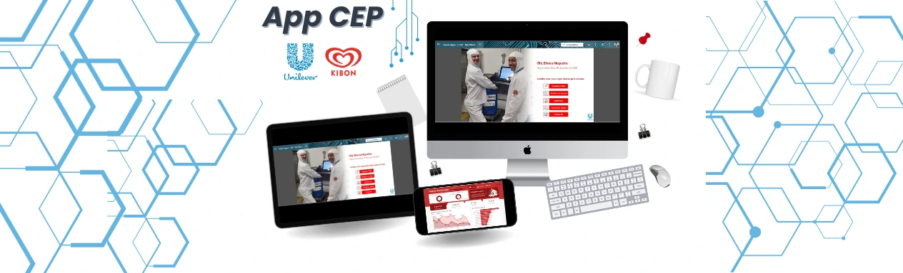

# 

# 📌 CEP - Mix Plant

💼 **Cliente**: Unilever (Kibon)  
🛠 **Tecnologia**: PowerApps, Power Automate, Power BI, SharePoint  
📅 **Ano**: 2024

---

## 🧐 Sobre o Projeto

Este aplicativo foi desenvolvido para digitalizar e otimizar o controle estatístico de processos (CEP) na produção da Unilever. Ele substituiu registros manuais em planilhas de Excel, garantindo mais eficiência, confiabilidade e automação dos dados.

---

## 🚀 Impacto

- ✅ **Redução de erros e inconsistências nos registros**
- ✅ **Maior agilidade na análise e consulta de dados**
- ✅ **Automação de processos com integração ao Power BI e SharePoint**
- ✅ **Integração do Power Automate para automação de fluxos de trabalho**

---

## 🖥 Interface e Funcionalidades

- **Cadastro de MIX** para acompanhamento da produção
- **Análise do açúcar e pHmetro** para controle de qualidade
- **Consulta de dados de processos anteriores**
- **Integração com Power BI** para visualização e tomada de decisões
- **Integração com SharePoint e Power Automate** para automação de fluxos e armazenamento de dados

---
